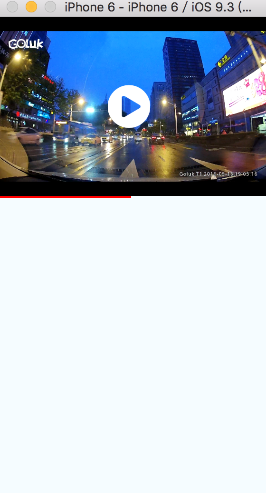
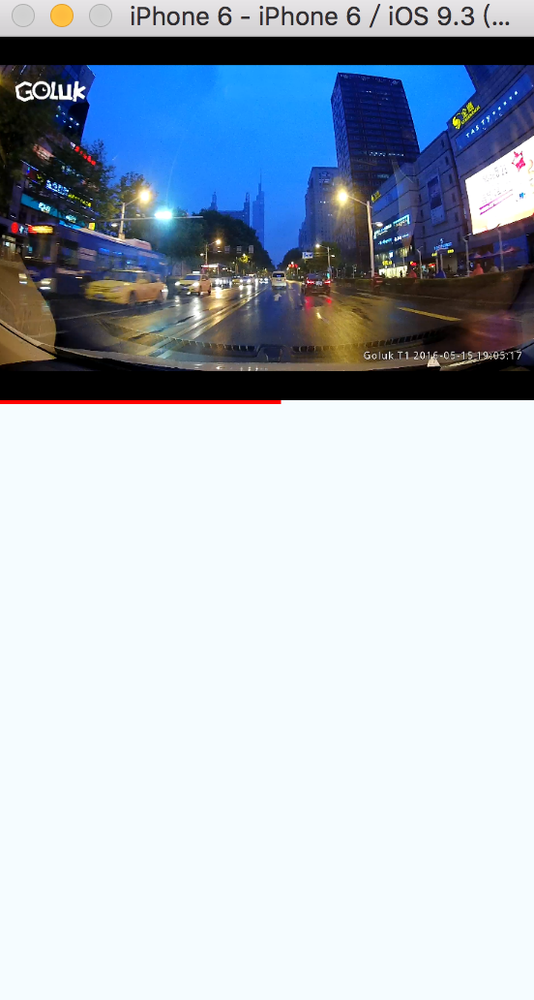

# react-native-vlcplayer

A `<VLCPlayer>` component for react-native  
此项目 参考react-native-video，但是有很多mp4 ios的硬解码无法播放，所以诞生了这个项目，这是一个足够简单的封装，全功能播放器的控制条留给自己去实现，同时可以参考[移动播放器][2]的例子。

VLCPlayer 支持各种格式(mp4,m3u8,flv,mov,rtsp,rtmp,etc.)，具体参看[vlc wiki][3]




### Add it to your project

Run `npm install react-native-vlcplayer --save`

#### iOS

- Install [rnpm](https://github.com/rnpm/rnpm) and run `rnpm link react-native-vlcplayer`

- 安装`MobileVLCKit.framework`,在[nightlies.videolan.org/build/ios/](nightlies.videolan.org/build/ios/) 下载最新版，解压后在你的工程里面引入`MobileVLCKit.framework`，并且添加 framework search path


## Usage


这是一个极其简单的VLC播放器，默认是不带控制条和进度条，但是完全可以通过回调实现自己需要的样式的播放器，参看例子[Examples vlcplayer][2]，包括一个简单播放器和一个全功能播放器。

```
<VLCPlayer
    ref='vlcplayer'
    paused={this.state.paused}  //通过paused设置player play or pause的状态
    style={styles.vlcplayer}
    source={{uri:this.props.uri,initOptions:['--codec=avcodec']}} 
    onProgress={this.onProgress.bind(this)} //进度回调
    onEnded={this.onEnded.bind(this)} //结束回调，一般使用stopped即可
    onStopped={this.onEnded.bind(this)} //停止回调
    onPlaying={this.onPlaying.bind(this)} //开始播放回调
    onBuffering={this.onBuffering.bind(this)} //正在缓冲回调
    onPaused={this.onPaused.bind(this)} //暂停回调
 />
 
```
//source.uri，可以是vlc支持的串流，或者普通的url,source.initOptions VLC支持的初始化选项 ,See [vlc 命令行参数][1]

## FullScreen ##
需要用到 `npm install react-native-orientation --save` ，工程配置参看[https://github.com/yamill/react-native-orientation](https://github.com/yamill/react-native-orientation)  
具体使用方法，参看`vlcplayer/Video.js`

## Static Methods

`seek(seconds)`

```
this.refs['vlcplayer'].seek(0.333); //单位是 0~1 的百分比
```

`snapshot(path)`

```
this.refs['vlcplayer'].snapshot(path); //保存截图
```

## Examples

- 进入 [移动播放器][2]  
- `npm install`   
- `rnpm link`  
- 同时需要安装`ART`   
参考[https://github.com/oblador/react-native-vector-icons][4]

可以根据自己的情况使用下面的例子，自己DIY播放器  
- `<SimpleVideo />` 一个简单的播放器  
- `<Video />` 一个全功能的播放器

```
import React, { Component } from 'react';
import {
 AppRegistry,
 View,
 Text
} from 'react-native';
import SimpleVideo  from './SimpleVideo.js';
import Video  from './Video.js';


class vlcplayer extends Component {

  render() {
    const uri = 'http://cdn.goluk.cn/video/t1_2.mp4';
    return (
      <View>
      <SimpleVideo uri={uri} buttonSize={50} />
      <Text>A Simple Player</Text>
      <View style={{marginTop:50}} />
      <Video uri={uri} />
      <Text>A full-featured player</Text>
      </View>
    );
  }
}

AppRegistry.registerComponent('vlcplayer', () => vlcplayer);

```


## TODOS

- [ ] Add support for Android
- [x] Add support for snapshot
- [ ] Add support for record
- [x] Add support for A full-featured player


## 加入ReactNative讨论组  
  
###`QQ群：316434159`  ###
![扫描加入][5]

[1]:https://wiki.videolan.org/VLC_command-line_help/
[2]:https://github.com/xiongchuan86/react-native-vlcplayer/tree/master/Examples/vlcplayer
[3]:https://wiki.videolan.org/Documentation:Documentation/
[4]:https://github.com/oblador/react-native-vector-icons
[5]:ReactNative_qq_group.png

---

**MIT Licensed**
